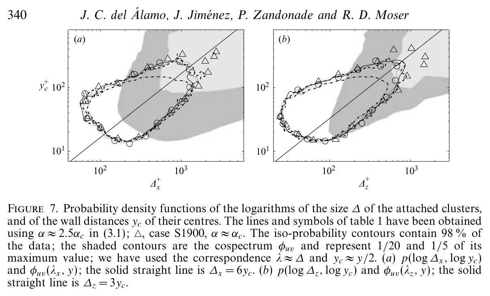
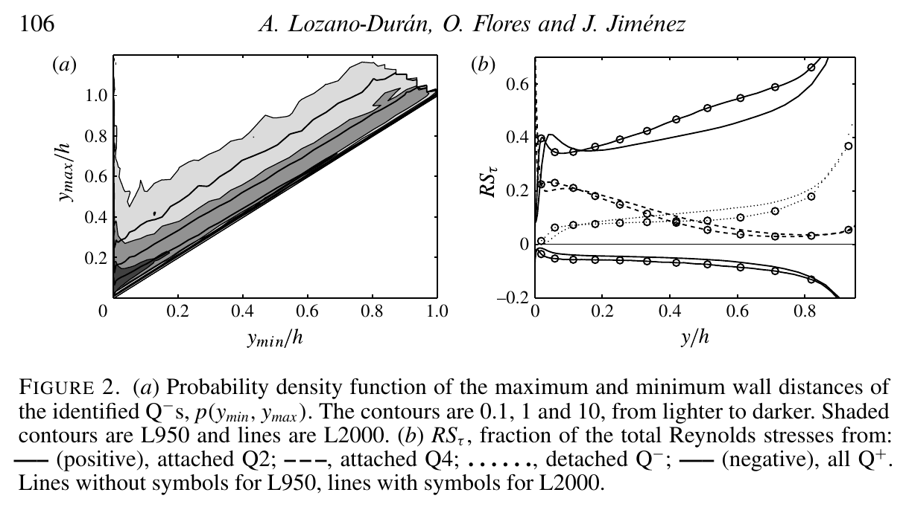
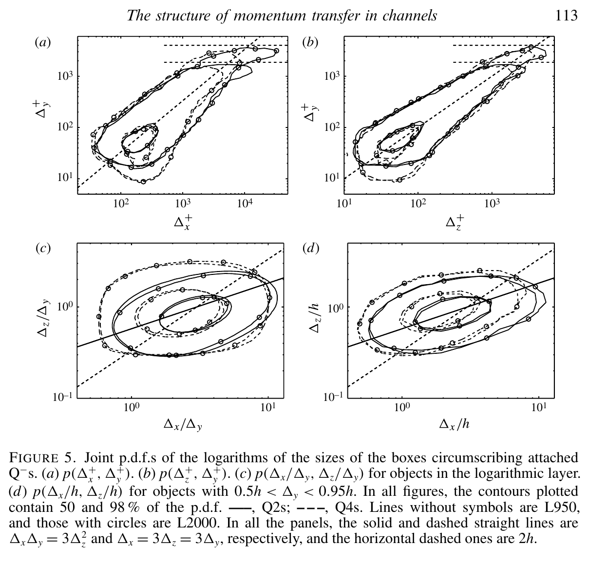
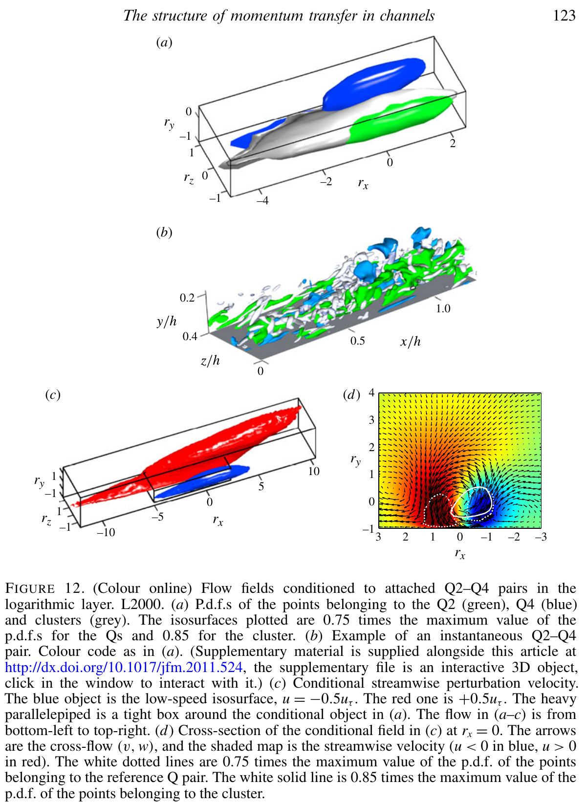
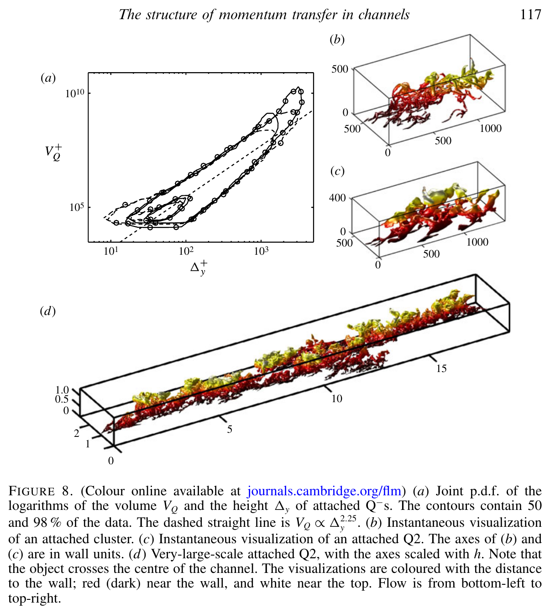
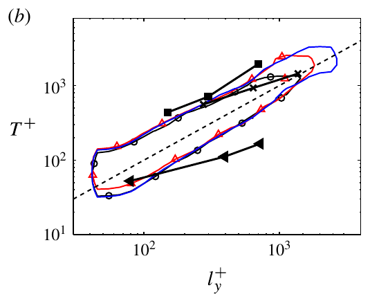
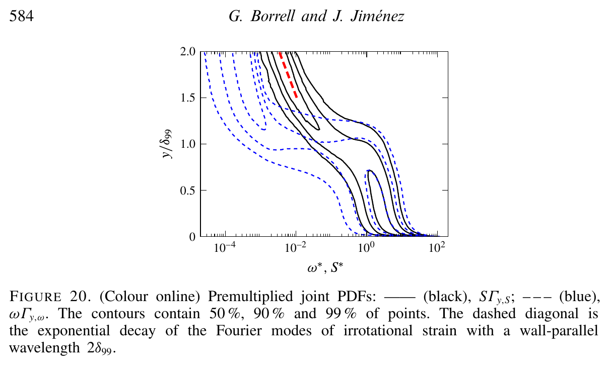
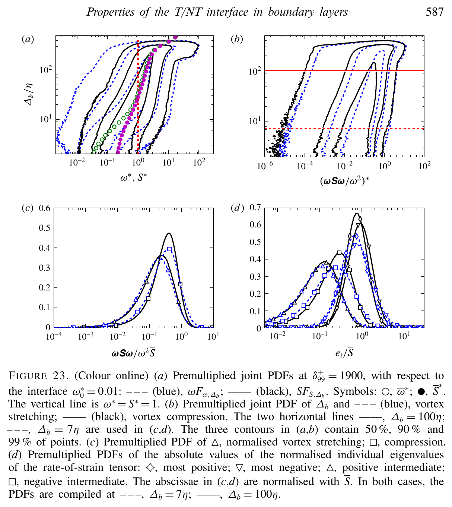
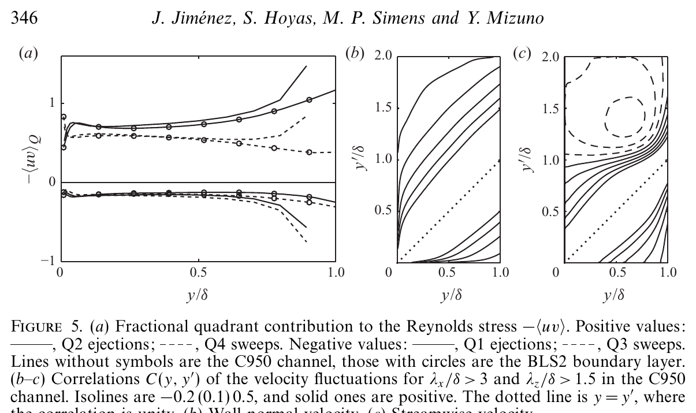
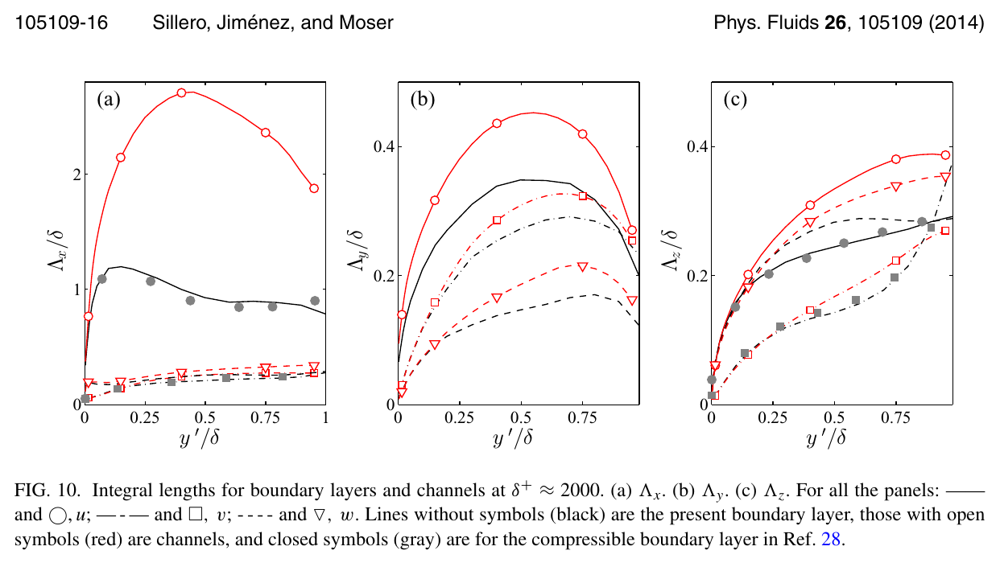

# A Structural Framework for Wall-Bounded Turbulence:
## The Boundary Layer as an Unconfined, Intermittent Canopy

> **Publication version:** [compiled PDF](article/main.pdf) · [LaTeX source and arXiv instructions](article/)

### Abstract

This paper develops a structural interpretation of the outer region of a zero-pressure-gradient turbulent boundary layer (ZPG TBL) by combining three results that are usually discussed separately: the hierarchy of wall-attached momentum-transfer and vortex structures, their temporal similarity, and the geometry of the turbulent/non-turbulent interface (TNTI). The evidence supports a *canopy* picture in which self-similar motions of many sizes overlap below the boundary-layer edge, while only the largest motions reach the intermittent region. Published figures show that intense attached Reynolds-stress objects in channels have dimensions approximately proportional to their height and carry about 60% of the Reynolds stress while occupying less than 8% of a wall-parallel plane at the identification threshold used by Lozano-Durán, Flores & Jiménez (2012). Related vortex clusters have comparable aspect ratios and a scale-dependent population. Independent boundary-layer experiments and DNS identify analogous wall-attached packet and velocity structures through the logarithmic layer, although not at the TNTI itself. Time-resolved tracking shows that tall attached structures preserve the same similarity in time: their lifetimes scale with their height and \(u_\tau\). They can therefore contribute to a canopy without introducing a new outer time scale that would break wall similarity.

At the outer boundary, we adopt the vorticity-interface definition and conditional coordinate established by Borrell & Jiménez (2016). Their figure 20 shows that the same wall-derived star scaling for vorticity and strain remains applicable through and well past the mean \(\delta_{99}\), including intermittent excursions. This scaling continuity does not imply amplitude continuity: strain drops by more than one order of magnitude before the much weaker potential-flow branch decays exponentially. Their figure 23 shows that, on the turbulent side, locally normalised stretching and strain geometry remain similar between the interface buffer and the core. We hypothesise that the TNTI is the convoluted outer envelope at which the wall-attached cluster hierarchy terminates: the intermittent region is where that hierarchy becomes sparse. The resulting cluster-to-interface connection is deliberately weak: attached structures are established in the cluster-bearing core, and interface-conditioned data show similar normalised physics up to the local turbulent edge, including its intermittent excursions, but the two have not been labelled jointly. This weak connection yields direct predictions for joint cluster/interface measurements.

---

## 1. Motivation and scope

Classical descriptions of ZPG TBLs use several complementary languages. Mean-flow descriptions divide the layer into viscous, logarithmic, wake, and intermittent regions. Structural descriptions use streaks, sweeps, ejections, vortex clusters, uniform-momentum zones, and attached eddies. Interface descriptions distinguish rotational turbulence from its irrotational surroundings. These descriptions are not contradictory, but they refer to different observables and should not be identified without an explicit argument.

The purpose of this paper is to ask whether they can be organised into one economical picture. The proposed answer is the **intermittent-canopy hypothesis**:

> The logarithmic and outer regions contain a hierarchy of overlapping, approximately self-similar turbulent structures. Their population and spatial coverage decrease with height. Near the boundary-layer edge, the union of the surviving structures becomes sparse and its convoluted vortical boundary is observed as the TNTI.

The word *canopy* is useful because it conveys overlap, a distribution of heights, and an irregular upper envelope. It should not be interpreted as a forest of isolated, permanent vortex tubes rooted at the wall. The structures extracted from DNS are multiscale objects rather than idealised individual vortices. Moreover, most of the three-dimensional cluster evidence discussed below comes from channels, whereas the interface evidence comes from a spatially developing boundary layer. The synthesis is plausible only to the extent that the relevant logarithmic-layer organisation is shared by both flows.

To keep observation separate from interpretation, the paper uses the following hierarchy:

1. **Direct evidence:** a statistic or geometry displayed in a cited figure.
2. **Supported inference:** a conclusion made in the source paper from several such statistics.
3. **Canopy hypothesis:** the central proposal of this paper---that the TNTI is the outer envelope of the sparse wall-attached cluster hierarchy---together with predictions that can be tested by joint labelling.

This distinction matters. For example, a wall-attached Reynolds-stress object is not the same thing as a connected vorticity object, and neither is automatically the same thing as the turbulent region defined by the TNTI.

---

## 2. Definitions and scales

Let \(x\), \(y\), and \(z\) denote the streamwise, wall-normal, and spanwise directions. The velocity fluctuations are \((u,v,w)\), the friction velocity is \(u_\tau\), the kinematic viscosity is \(\nu\), and \(\delta_{99}\) is the height at which the mean velocity reaches 99% of the free-stream value. Wall units are denoted by a superscript \(+\), so that

\[
\delta_{99}^{+}=\frac{u_\tau\delta_{99}}{\nu}.
\]

A quadrant object is a connected region in which the instantaneous tangential Reynolds stress exceeds a threshold. Ejections are Q2 events, \(u<0\), \(v>0\), and sweeps are Q4 events, \(u>0\), \(v<0\). In the work of Lozano-Durán *et al.* [5], an object is called attached when its lowest point lies within about 20 wall units of the wall. This is an operational definition of geometric connectivity, not a statement that the entire object was born at the wall.

The vorticity magnitude is \(\omega=|\boldsymbol{\omega}|\). Following Borrell & Jiménez [9], a vorticity interface is constructed from an isosurface \(\omega=\omega_0\), after removing disconnected drops and bubbles when required. Their dimensionless interface scales are

\[
\omega^{*}=\omega^{+}\sqrt{\delta_{99}^{+}}, \qquad
S^{*}=S^{+}\sqrt{\delta_{99}^{+}},
\]

where \(\omega^+=\omega\nu/u_\tau^2\) and \(S^+=S\nu/u_\tau^2\).

Equivalently, the dimensional edge-vorticity scale is

\[
\omega_e \sim \frac{u_\tau^2}{\nu\sqrt{\delta_{99}^{+}}}
             = \sqrt{\frac{u_\tau^3}{\nu\delta_{99}}}.
\]

This follows, up to constants, from local equilibrium above the buffer layer,
\(\nu\omega_e^2\sim u_\tau^3/\delta_{99}\). It is important that the factor is
\(\sqrt{\delta_{99}^{+}}\) in the definition of \(\omega^*\), not its inverse. It is also the friction velocity, rather than \(U_\infty\), that enters this scaling.

With the interface convention fixed as in [9], let \(\gamma(y)\) be the probability that a point at height \(y\) lies on the turbulent side. It is **not** generally equal to \(\Pr\{h_k>y\}\), where \(h_k\) is the height of a cluster. Pointwise coverage also depends on each object's footprint, overlap, and connectivity. The earlier, simpler identification of intermittency with a cumulative cluster-height distribution is therefore too strong.

### 2.1 Map from claims to published figures

The principal visual and quantitative evidence used in the synthesis is summarised here so that each claim can be checked against the source rather than inferred from the canopy metaphor.

| Result used here | Published evidence |
|---|---|
| Attached vortex clusters have dimensions proportional to height, and their number density has a scale-dependent tail. | Del Álamo *et al.* [3], figures 7–10. |
| Attached Q2/Q4 objects dominate the identified Reynolds-stress contribution while occupying a small area. | Lozano-Durán *et al.* [5], figure 2 and §3.2. |
| The self-similar Q family has \(\Delta_x\simeq3\Delta_y\), \(\Delta_z\simeq\Delta_y\); the largest centreline-crossing objects are composite. | [5], figures 5, 6, and 8. |
| Vortex clusters and Q objects overlap statistically and form preferential Q2–Q4 arrangements. | [5], figures 10–12. |
| Independent ZPG-boundary-layer studies recover wall-attached scale growth, three-dimensional packet signatures, and self-similar attached velocity structures to about \(0.18\delta\). | Tomkins & Adrian [12]; Dennis & Nickels [13]; Hwang & Sung [14]. |
| Tracked tall attached branches preserve geometrical and temporal wall similarity: \(T u_\tau/\Delta_y=O(1)\). | Lozano-Durán & Jiménez [7], figures 8–9. |
| Turbulent-level vorticity and strain terminate at the TNTI, while core-like normalised straining persists up to its turbulent side. | Borrell & Jiménez [9], figures 20 and 23. |
| Large channel motions cross the centreline, while TBL intermittency is associated with pressure and intensity differences. | Jiménez *et al.* [4], figures 3–8. |
| The TBL–channel intensity difference peaks in the outer layer at comparable locations over the available Reynolds numbers. | Sillero *et al.* [6], figure 6. |
| Weak streamwise correlations are much longer in channels than in TBLs, despite similar cross-flow organisation. | Sillero *et al.* [8], figures 3–5 and 9–10. |

---

## 3. Evidence for a self-similar structural hierarchy

### 3.1 From planar signatures to three-dimensional objects

The PIV measurements of Adrian, Meinhart & Tomkins [1] established that the outer TBL contains repeated combinations of spanwise vorticity and strong Q2 motion. Their Reynolds-number range, \(930<Re_\theta<6845\), and the 30–60° locus of the Q2 signatures supported the hairpin-packet interpretation. Because the measurements were streamwise–wall-normal planes, however, they could not determine the connectivity of the structures in the omitted spanwise direction.

Three-dimensional DNS changes the question from “what pattern crosses a plane?” to “which points belong to one connected object?” Del Álamo *et al.* [3] identified vortex clusters in channels. Their figures 7 and 8 show that the bounding dimensions of the tall attached family scale with cluster height. The resulting mean dimensions are approximately

\[
\Delta_x\simeq 3\Delta_y, \qquad \Delta_z\simeq 1.5\Delta_y.
\]

*Figure 1. Joint distributions of attached-cluster streamwise and spanwise dimensions versus the wall distance of their centres. The diagonal trends, obtained in the S1900 channel at \(Re_\tau\approx1900\), are the direct evidence for geometrical self-similarity. Extracted from del Álamo et al. [3], source figure 7.*

The S1900 Reynolds number is comparable to the upper range of the boundary-layer interface data in [9], although the flow geometry is different. Figure 1 supplies the wall-similar cluster hierarchy required by the hypothesis; the interface side of the proposed identification is developed in §4. The population is scale-dependent. In figure 9(a) of [3], the number density per unit wall area and unit height has a power-law tail. Figure 10 shows that its exponent approaches \(-3\) as the vortex threshold approaches the percolation transition. This is the population law expected for Townsend-like geometrical self-similarity.

Lozano-Durán *et al.* [5] performed the corresponding analysis for intense momentum-transfer objects. Their figure 2 separates attached from detached Q objects. At the selected threshold, the attached Q2/Q4 objects occupy less than 8% of a wall-parallel plane but contribute approximately 60% of the mean Reynolds shear stress at all heights. This is a more precise and defensible statement than saying that the structures occupy the entire flow or carry more than 80% of the stress.

*Figure 2. The left panel separates attached and detached Q objects geometrically; the right panel shows their fractional Reynolds-stress contributions. Extracted from Lozano-Durán et al. [5], source figure 2.*

Figure 5 of [5] gives

\[
\Delta_x\simeq 3\Delta_y, \qquad \Delta_z\simeq \Delta_y
\]

for the self-similar attached Q family.

*Figure 3. Candidate building blocks of the canopy. The diagonal trends in panels (a,b) show dimensions proportional to object height. Panel (d) shows that the largest thresholded objects depart from the simple family and should be interpreted as composites rather than single self-similar eddies. Extracted from Lozano-Durán et al. [5], source figure 5.*

The close agreement with the vortex-cluster dimensions is significant, but it does not imply identity. Figure 10(a) shows that more than 80% of attached vortex clusters intersect a Q object, while the reverse probability decreases with height because tall Q objects outnumber tall vortex clusters. Figure 11 and the conditional field in figure 12 support a predominant side-by-side Q2–Q4 pair, with a vortex cluster preferentially associated with the Q2 and the shear layer beneath the Q4. For the canopy hypothesis, this association matters because the Q2 ejection supplies the outward-transport component linked to the vortical object.

*Figure 4. Candidate transport element of the canopy: a Q2–Q4 pair and its associated velocity field. Green denotes the Q2 ejection, blue the Q4 sweep, and grey the vortex cluster. The cluster–ejection association links the vortical hierarchy to outward transport. Extracted from Lozano-Durán et al. [5], source figure 12.*

The channel result is not the only evidence for an attached hierarchy. In ZPG boundary layers, Tomkins & Adrian [12] found spanwise scales growing linearly with wall distance, Dennis & Nickels [13] measured three-dimensional vortex-packet signatures, and Hwang & Sung [14] identified self-similar attached structures in all three velocity components. The last study reconstructed logarithmic intensity from the attached population over \(100<y^+<0.18\delta^+\). These studies concern velocity or planar vortex signatures rather than the connected gradient clusters used here, and they stop below the intermittent edge. Nevertheless, they anchor the wall-attached hierarchy in a boundary layer at approximately \(0.2\delta\), rather than only in channels.

Together, these observations provide the proposed canopy with candidate building blocks and a transport mechanism:

* height-scaled attached objects supply the hierarchy;
* their association with Q2 ejections supplies outward transport;
* their decreasing population with height supplies the sparsity required near the edge.

They do not justify treating velocity, stress, and vorticity objects as interchangeable.

### 3.2 From self-similar elements to a canopy

The canopy hypothesis does not require the outer layer to be one giant coherent object. Simple self-similarity breaks down for the largest thresholded channel structures. Figure 8(d) of [5] shows a very-large Q2 crossing the centreline that is visibly assembled from smaller pieces. Objects crossing the centreline account for roughly one third of the stress carried by attached Q objects; fewer than 1% of the objects account for about 60% of their volume; and their streamwise lengths can approach \(20\delta\).

*Figure 5. From elements to canopy. Panels (b,c) show an attached vortex cluster and Q2; panel (d) shows a very-large centreline-crossing Q2 assembled from smaller pieces. The canopy is interpreted as the sparse union of height-scaled elements, not as one monolithic eddy. Extracted from Lozano-Durán et al. [5], source figure 8.*

This composite character is part of the canopy argument rather than an exception to it. The TNTI would be the envelope of the union of many overlapping height-scaled elements; it need not coincide with the boundary of one segmented cluster. Consequently, the height of a percolated object is not the size of one dynamical eddy. Long streamwise-velocity correlations and global spectral modes can also combine active and inactive motions and should not be identified with the rotational canopy itself [2].

### 3.3 Preservation of wall similarity

The time-resolved result needed by the cluster-to-interface hypothesis is whether the structures forming the canopy preserve wall similarity. Lozano-Durán & Jiménez [7] show that tall attached branches remain geometrically self-similar and that their lifetimes satisfy

\[
T u_\tau/\Delta_y=O(1).
\]

*Figure 6. Lifetime of tall attached Q branches versus branch height. The dashed diagonal is \(T^+=l_y^+\). The collapse shows that the temporal scale is set by the same height and friction velocity that describe the attached hierarchy. Extracted from Lozano-Durán & Jiménez [7], source figure 9(b).*

Thus the tracked structures introduce neither a separate outer length nor a separate outer time scale: geometrical dimensions scale with \(\Delta_y\), and duration scales with \(\Delta_y/u_\tau\). This is the role of the time-resolved evidence in the hypothesis: the coherent structures can form a canopy while preserving wall similarity. The identification of that canopy with the boundary-layer interface is then supplied by the termination and inner-side evidence in §4.

---

## 4. Wall-similar physics at the established T/NT interface

We use the interface-conditioned statistics reported by Borrell & Jiménez [9] directly. Because their coordinate follows the local interface, the conditional ensemble includes both valleys below and bulges above the mean \(\delta_{99}\). Figure 7 records the relevant scaling observation; the amplitude distinction between turbulent and potential strain is noted in its caption.

*Figure 7. Joint wall-normal distributions in the same wall-derived star units: vorticity \(\omega^*\) (blue dashed contours) and strain \(S^*\) (black solid contours). The relevance to the hypothesis is that this scaling remains applicable through and well past the mean \(\delta_{99}\), including intermittent excursions sampled by the local interface. This is scaling continuity, not amplitude continuity: turbulent-level strain drops by more than one order of magnitude near the edge, after which the much weaker potential branch follows the exponential decay marked in red. Extracted from Borrell & Jiménez [9], source figure 20.*

### 4.1 Core-like organisation up to the turbulent side

The original canopy argument treated the interface as the point where cluster tips lose mean-shear production and decay purely by viscosity. The conditional data require a more nuanced description.

Figure 23 of [9] concerns the turbulent side of the interface, not continuity into the potential flow. Its key conclusion is that vorticity in the interface buffer lives in essentially the same straining environment as the turbulent core. Panel (a) follows the joint vorticity and strain distributions towards the TNTI; panel (b) follows stretching and compression. In panels (c,d), the samples at \(7\eta\) and \(100\eta\) correspond respectively to the interface buffer and the turbulent core. Once normalised by the local strain magnitude, the stretching/compression and strain-eigenvalue distributions are similar. Thus the internal organisation remains core-like as the cluster hierarchy approaches its outer termination, even though the amplitudes subsequently collapse across the interface.

*Figure 8. Conditional gradient statistics on the turbulent side of the vorticity interface. Blue dashed curves sample the interface buffer at \(7\eta\); black solid curves sample the core at \(100\eta\). Their near collapse after local-strain normalisation shows persistence up to the edge, not continuity across it. Extracted from Borrell & Jiménez [9], source figure 23.*

This is the weak bridge used in the present hypothesis. Independent boundary-layer evidence places a wall-attached hierarchy in the cluster-bearing flow up to approximately \(0.2\delta_{99}\), while the interface-conditioned statistics show essentially the same normalised straining physics from the core to the local turbulent edge near \(\delta_{99}\), including the ensemble of peaks above it. We infer---but do not directly observe---that the attached cluster hierarchy carries that physics to the edge and terminates there. The TNTI is proposed to be the envelope of those terminations.

---

## 5. A weak cluster-to-interface connection

The argument deliberately combines strong observations through one weak inference:

1. In channels, attached vortex and momentum-transfer clusters form a wall-similar hierarchy, are associated with ejections, and preserve height-based length, velocity, and time scaling to the outermost wall distances.
2. Independent ZPG-boundary-layer measurements and DNS recover wall-attached packet and velocity structures through the logarithmic layer, reaching approximately \(0.2\delta_{99}\).
3. Interface-conditioned statistics include the local intermittent valleys and peaks and show that the normalised straining environment in the interface buffer is essentially the same as in the turbulent core.
4. The same wall-derived scaling for \(\omega\) and \(S\) remains applicable through the local edge and its excursions beyond \(\delta_{99}\), even though turbulent-level amplitudes terminate sharply and the exterior branch is much weaker and potential.

The weak inference is that the attached gradient clusters known in channels are the carriers of the wall-similar physics observed in the boundary-layer core and remain its carriers up to the local interface, including canopy peaks above \(\delta_{99}\). On that basis, we hypothesise that the intermittent region is the sparse upper support of the wall-attached hierarchy and that the TNTI is its convoluted outer envelope. The inference is weak because the channel clusters, boundary-layer attached velocity structures, and interface-conditioned gradients are different observables from different datasets; it is nevertheless constrained by their common scaling and dynamics.

A joint object/interface analysis provides a direct test: vorticity clusters, Q structures, and the TNTI should be extracted simultaneously from the same TBL snapshots and their conditional intersections measured. The existing result that more than 80% of channel vortex clusters intersect Q objects [5, figure 10] supplies a concrete expectation for that test.

A similarly careful statement is needed about vorticity. For incompressible, constant-density flow,

\[
\frac{D\boldsymbol{\omega}}{Dt}
 = (\boldsymbol{\omega}\!\cdot\!\nabla)\mathbf{u}
 + \nu\nabla^2\boldsymbol{\omega}.
\]

There is no baroclinic source in this equation. The wall supplies vorticity to a boundary layer, stretching and tilting redistribute and amplify it, and viscosity diffuses it across the TNTI. But this global statement does not imply a Lagrangian conveyor belt in which identifiable vortex objects travel intact from the wall to \(\delta_{99}\). The tracking evidence argues against that literal interpretation.

---

## 6. Boundary layers and channels: open edge versus centreline coupling

A channel is not simply a boundary layer with a reflecting outer boundary. Jiménez *et al.* [4] show two distinct effects. First, their figure 5(b,c) demonstrates that large-scale velocity correlations cross the channel centreline; ejections from one half can penetrate into the other. Second, figures 3 and 4 show that the TBL replaces this interaction with an intermittent mixture of vortical and potential fluid and associated pressure fluctuations. Figure 6 links those pressure effects to different outer energy production, and figure 8 locates the largest spectral-intensity differences around \(y/\delta\simeq0.2\)–0.5.

*Figure 9. Quadrant contributions in a channel and boundary layer (a), followed by wall-normal (b) and streamwise (c) large-scale channel correlations. The contours crossing \(y/\delta=1\) demonstrate centreline coupling but do not, on their own, demonstrate a destructive collision. Extracted from Jiménez et al. [4], source figure 5.*

Higher-Reynolds-number one-point statistics confirm the difference. Figure 6 of Sillero, Jiménez & Moser [6] shows that all three velocity-component intensities exceed their channel values in the TBL, with the largest difference near \(y/\delta\simeq0.35\)–0.5 and little change in that location between the two Reynolds numbers compared. This is consistent with an edge-mediated pressure and entrainment effect, not with the outer TBL being dynamically empty.

The three-dimensional correlations in Sillero *et al.* [8] provide the strongest correction to the earlier “channel traffic jam” interpretation:

* Figures 3, 5, 9, and 10 show that weak streamwise-velocity correlations are **longer in channels**, reaching approximately \(18\delta\), than in boundary layers, where they reach approximately \(7\delta\).
* Figure 4 shows that the cross-flow organisation is nevertheless qualitatively similar in the two flows.
* Figure 10 places the channel maximum near \(y/\delta\simeq0.5\); the authors suggest that intermittency prevents the corresponding global structure from forming in the TBL.
* Figure 12 shows that the \(u\)-\(v\) cross-correlation has an extent intermediate between the long streamwise-velocity and short wall-normal-velocity correlations. The source paper warns that this correlation is not itself the geometry of instantaneous momentum transfer.
* Figure 18 shows that channel ejections are much longer than sweeps in the outer region, while their lengths are closer in the boundary layer.

*Figure 10. Integral correlation lengths for the three velocity components. In panel (a), the red channel curve for streamwise velocity continues to grow to \(y/\delta\approx0.5\), while the black boundary-layer curve levels off much earlier. Extracted from Sillero et al. [8], source figure 10.*

Thus there is evidence for centreline crossing and coupling, but not for the claim that opposing hierarchies collide and destroy self-similar scaling. Nor do the cited figures show pressure–strain being artificially reoriented by a collision. If anything, the longest global streamwise modes are more developed in channels. The defensible comparison is:

* **Channel:** no TNTI, communication across the centreline, and very long global streamwise modes.
* **Boundary layer:** an open, intermittent edge, stronger pressure and transverse-velocity fluctuations, shorter streamwise correlations, and rapid correlation growth in the potential region.

“Unconfined” therefore does not mean “simpler.” It means that the outer boundary condition is supplied by an irrotational free stream rather than by another turbulent half-channel.

---

## 7. Direct tests of the intermittent-canopy hypothesis

The synthesis can be tested quantitatively with existing or modest extensions of existing DNS data.

### 7.1 Joint object/interface labelling

For each snapshot, identify the TNTI using the established convention of [9], together with attached vorticity clusters and attached Q objects. Measure

\[
P(d_{\mathrm{TNTI}}<a\lambda\mid \text{top of attached object})
\]

and compare it with randomised objects of the same size and height. A canopy interpretation predicts a strong excess near the tops of the largest objects.

### 7.2 Coverage rather than height alone

Construct the pointwise union of objects and compare its coverage

\[
\gamma_Q(y;H)=
\Pr\{(x,y,z)\in\cup_k Q_k(H)\}
\]

with the vorticity intermittency \(\gamma(y)\). The comparison should include object footprints and overlaps. A height cumulative distribution alone is insufficient.

### 7.3 Conditional budgets at structural tips

Evaluate mean-shear production, nonlinear transport, vortex stretching, and viscous diffusion conditioned jointly on distance from the TNTI and distance from an object top. If sparse cluster tips form the interface, the conditional budgets should differ from generic interface points at the same height. This test would determine whether the core-like straining observed on the turbulent side in [9, figure 23] is specifically associated with attached cluster tips.

### 7.4 Matched channel/boundary-layer comparison

Use the same thresholds and object definitions at matched \(Re_\tau\). Compare object populations, height scaling, centreline/TNTI termination, and canopy coverage. This would replace qualitative “collision” and “freedom” metaphors with measurable differences.

---

## 8. Conclusions

The published evidence supports a unified but qualified structural narrative.

1. **Hierarchy.** Three-dimensional vortex clusters and intense Reynolds-stress objects contain attached, approximately self-similar families with wall-parallel dimensions proportional to their height [3,5]. At the threshold of [5], attached Q objects carry about 60% of the Reynolds stress while covering less than 8% of a plane.
2. **Wall similarity.** Tracked tall attached structures preserve geometrical and temporal similarity: their dimensions scale with height and their lifetimes with \(\Delta_y/u_\tau\) [7]. Independent boundary-layer studies recover analogous attached organisation to approximately \(0.2\delta_{99}\) [12–14].
3. **Wall scaling at the edge.** The same wall-derived star scaling for vorticity and strain remains applicable through and beyond the mean \(\delta_{99}\). Core-like normalised straining persists up to the turbulent side, even though turbulent-level amplitudes terminate sharply and only a weak potential branch remains outside [9, figures 20 and 23].
4. **Internal versus external flows.** Channel structures and correlations cross the centreline, whereas TBLs interact with potential fluid through intermittency and pressure. Channels possess longer, not shorter, global streamwise correlations [4,6,8].
5. **Weak cluster-to-interface connection.** Because the interface buffer has essentially the same normalised straining environment as the core, we infer that the wall-attached hierarchy carries its wall-similar physics from approximately \(0.2\delta_{99}\) to the local TNTI, including peaks above \(\delta_{99}\). The interface is proposed to be the envelope where that sparse hierarchy terminates.

The main value of the canopy framework is therefore not that it abolishes the outer layer, but that it proposes a weak, testable identification between the wall-similar attached hierarchy and the structural support of the T/NT interface. Figures 7 and 8 constrain that identification by showing respectively that wall-derived scaling remains applicable across the intermittent excursions, despite the amplitude separation at the edge, and that the normalised organisation remains core-like up to the turbulent side.

---

## Data availability

The DNS statistics and several datasets associated with the cited UPM studies are available through the [Fluid Dynamics Group at Universidad Politécnica de Madrid](https://torroja.dmt.upm.es/), including its [turbulence database](https://torroja.dmt.upm.es/turbdata/) and [paper datasets](https://torroja.dmt.upm.es/paperdat/). Availability differs by paper; the article and repository links below should be consulted for the exact fields and processing products.

## References

1. Adrian, R. J., Meinhart, C. D. & Tomkins, C. D. (2000). Vortex organization in the outer region of the turbulent boundary layer. *Journal of Fluid Mechanics*, **422**, 1–54. [doi:10.1017/S0022112000001580](https://doi.org/10.1017/S0022112000001580)
2. del Álamo, J. C., Jiménez, J., Zandonade, P. & Moser, R. D. (2004). Scaling of the energy spectra of turbulent channels. *Journal of Fluid Mechanics*, **500**, 135–144. [PDF](https://torroja.dmt.upm.es/pubs/2004/delAlamoJimenezZandonadeMoser_jfm_2004.pdf) · [doi:10.1017/S002211200300733X](https://doi.org/10.1017/S002211200300733X)
3. del Álamo, J. C., Jiménez, J., Zandonade, P. & Moser, R. D. (2006). Self-similar vortex clusters in the turbulent logarithmic region. *Journal of Fluid Mechanics*, **561**, 329–358. [PDF](https://torroja.dmt.upm.es/pubs/2006/delAlamoJimenezZandonadeMoser_jfm_2006_correctfig9.pdf) · [doi:10.1017/S0022112006000814](https://doi.org/10.1017/S0022112006000814)
4. Jiménez, J., Hoyas, S., Simens, M. P. & Mizuno, Y. (2010). Turbulent boundary layers and channels at moderate Reynolds numbers. *Journal of Fluid Mechanics*, **657**, 335–360. [PDF](https://torroja.dmt.upm.es/pubs/2010/jim_hoy_sim_miz_JFM2010.pdf) · [doi:10.1017/S0022112010001370](https://doi.org/10.1017/S0022112010001370)
5. Lozano-Durán, A., Flores, O. & Jiménez, J. (2012). The three-dimensional structure of momentum transfer in turbulent channels. *Journal of Fluid Mechanics*, **694**, 100–130. [PDF](https://torroja.dmt.upm.es/pubs/2012/ald_of_jj_2012_JFM.pdf) · [doi:10.1017/jfm.2011.524](https://doi.org/10.1017/jfm.2011.524)
6. Sillero, J. A., Jiménez, J. & Moser, R. D. (2013). One-point statistics for turbulent wall-bounded flows at Reynolds numbers up to \(\delta^+\approx2000\). *Physics of Fluids*, **25**, 105102. [PDF](https://torroja.dmt.upm.es/pubs/2013/sillero_jimenez_moser_PoF13.pdf) · [doi:10.1063/1.4823831](https://doi.org/10.1063/1.4823831)
7. Lozano-Durán, A. & Jiménez, J. (2014). Time-resolved evolution of coherent structures in turbulent channels: characterization of eddies and cascades. *Journal of Fluid Mechanics*, **759**, 432–471. [PDF](https://torroja.dmt.upm.es/pubs/2014/ald_jj_2014_JFM.pdf) · [doi:10.1017/jfm.2014.575](https://doi.org/10.1017/jfm.2014.575)
8. Sillero, J. A., Jiménez, J. & Moser, R. D. (2014). Two-point statistics for turbulent boundary layers and channels at Reynolds numbers up to \(\delta^+\approx2000\). *Physics of Fluids*, **26**, 105109. [PDF](https://torroja.dmt.upm.es/pubs/2014/sillero_jimenez_moser_2014_PoF_correlations.pdf) · [doi:10.1063/1.4899259](https://doi.org/10.1063/1.4899259)
9. Borrell, G. & Jiménez, J. (2016). Properties of the turbulent/non-turbulent interface in boundary layers. *Journal of Fluid Mechanics*, **801**, 554–596. [PDF](https://torroja.dmt.upm.es/pubs/2016/BorrellJim2016.pdf) · [arXiv:1606.08146](https://arxiv.org/abs/1606.08146) · [doi:10.1017/jfm.2016.430](https://doi.org/10.1017/jfm.2016.430)
10. Corrsin, S. & Kistler, A. L. (1955). Free-stream boundaries of turbulent flows. *NACA Technical Report* 1244. [NASA record](https://ntrs.nasa.gov/citations/19930091020)
11. Townsend, A. A. (1976). *The Structure of Turbulent Shear Flow*, 2nd ed. Cambridge University Press.
12. Tomkins, C. D. & Adrian, R. J. (2003). Spanwise structure and scale growth in turbulent boundary layers. *Journal of Fluid Mechanics*, **490**, 37–74. [doi:10.1017/S0022112003005251](https://doi.org/10.1017/S0022112003005251)
13. Dennis, D. J. C. & Nickels, T. B. (2011). Experimental measurement of large-scale three-dimensional structures in a turbulent boundary layer. Part 1. Vortex packets. *Journal of Fluid Mechanics*, **673**, 180–217. [doi:10.1017/S0022112010006324](https://doi.org/10.1017/S0022112010006324)
14. Hwang, J. & Sung, H. J. (2018). Wall-attached structures of velocity fluctuations in a turbulent boundary layer. *Journal of Fluid Mechanics*, **856**, 958–983. [arXiv:1804.11068](https://arxiv.org/abs/1804.11068) · [doi:10.1017/jfm.2018.727](https://doi.org/10.1017/jfm.2018.727)
